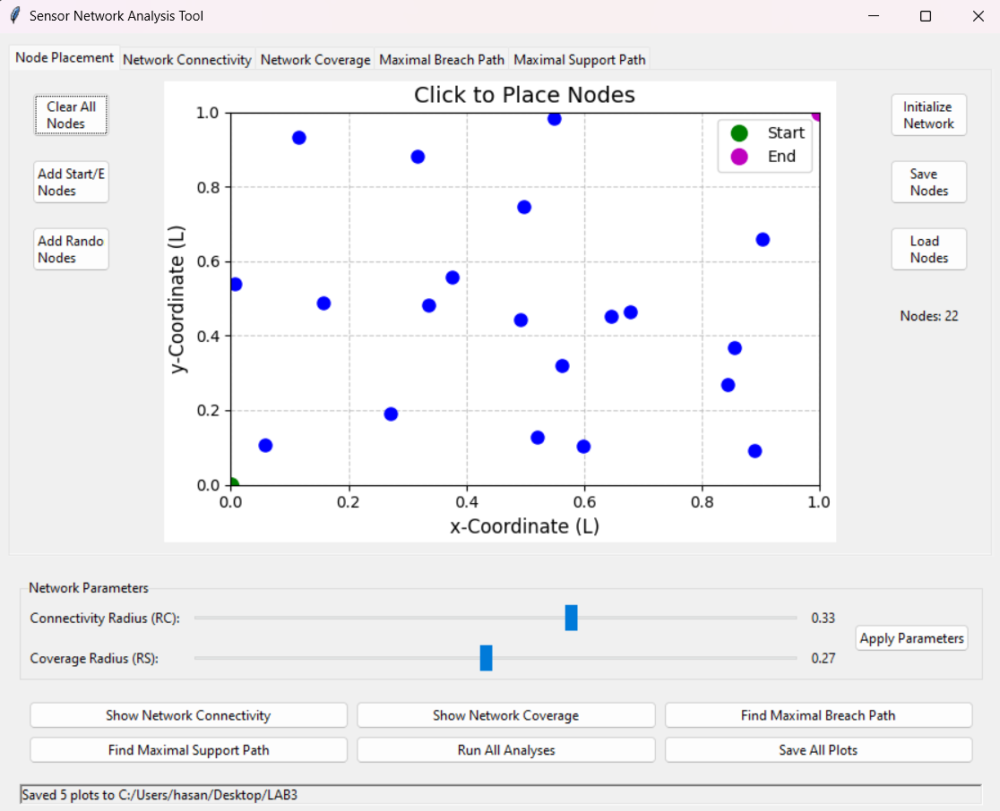
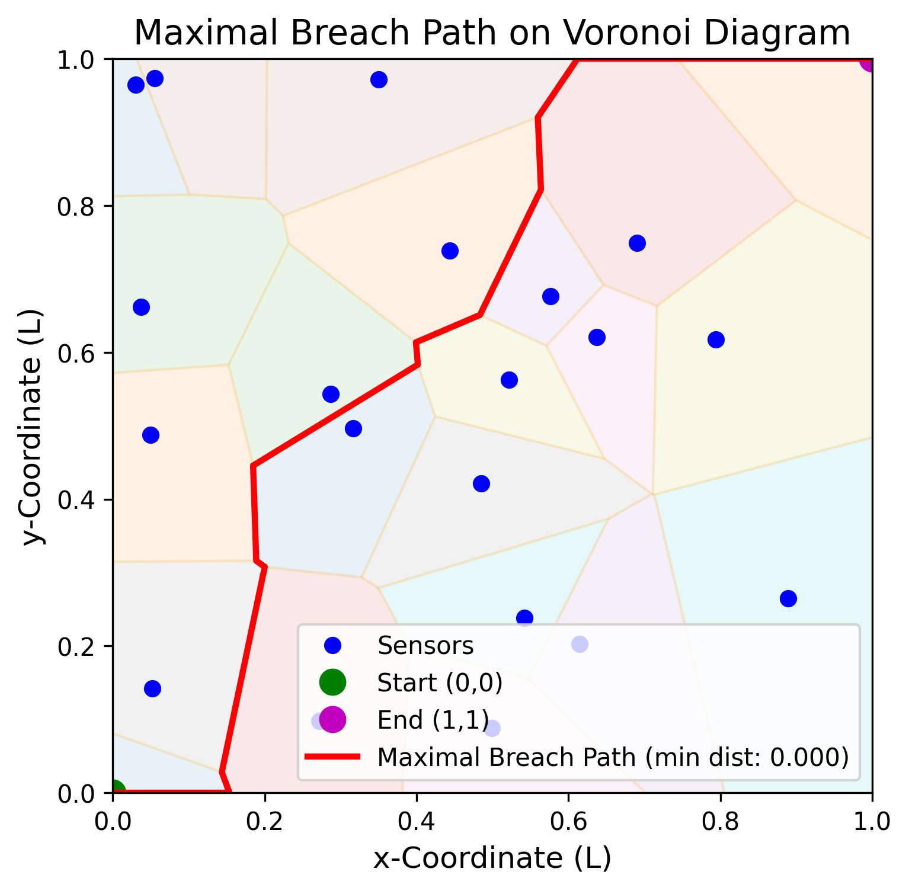
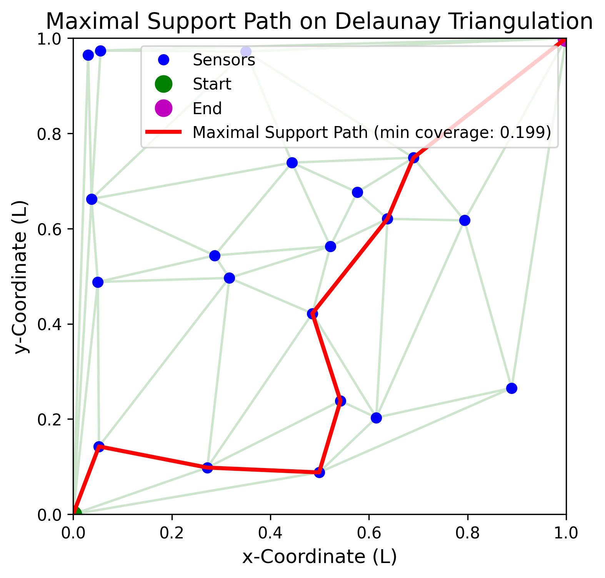

# Sensor Network Analysis Tool

## A comprehensive toolkit for analyzing wireless sensor networks with path optimization

[](https://opensource.org/licenses/MIT)
[](https://www.python.org/downloads/)

<p align="center">
  
</p>

## Overview

The Sensor Network Analysis Tool provides a robust framework for analyzing and visualizing wireless sensor networks deployed in a unit square area. The tool implements advanced algorithms to solve two critical path optimization problems:

1. **Maximal Breach Path**: Finding a path through the network that maximizes the minimum distance from any sensor (useful for stealth/security analysis)
2. **Maximal Support Path**: Finding a path that maximizes the minimum sensor coverage along the route (useful for ensuring sensor coverage)

The software includes both a command-line interface and a full-featured GUI for interactive experimentation with different sensor layouts and network configurations.

## Key Features

### Analysis Features
- Calculate and visualize network connectivity based on communication range
- Generate coverage maps showing the area covered by each sensor
- Compute Voronoi diagrams for maximal breach path analysis
- Compute Delaunay triangulations for maximal support path analysis
- Find optimal paths between any two points in the network
- Calculate path metrics (minimum distances, coverage levels)

### GUI Features
- Interactive node placement with mouse clicks
- Load and save node configurations
- Real-time visualization of analysis results
- Tab-based interface for organizing different analyses
- Export high-resolution plots in multiple formats
- Batch processing of all analyses

### Design Features
- Object-oriented architecture for maintainability
- Modular design with separation of concerns
- Efficient implementations of graph algorithms
- Multi-threaded processing to maintain UI responsiveness
- Comprehensive error handling

## Installation

### Prerequisites
- Python 3.6 or newer
- pip package manager

### Installation Steps

1. Clone this repository:
   ```bash
   git clone https://github.com/yourusername/sensor-network-analysis.git
   cd sensor-network-analysis
   ```

2. Install required dependencies:
   ```bash
   pip install -r requirements.txt
   ```

## Dependencies

The tool relies on the following Python packages:

- **numpy**: Array operations and numerical computations
- **scipy**: Spatial algorithms (Voronoi diagrams, Delaunay triangulations)
- **networkx**: Graph representation and algorithms
- **matplotlib**: Plotting and visualization
- **shapely**: Geometric operations
- **tkinter**: GUI framework (included in standard Python)

## Usage

### Command-line Interface

Run the basic analysis from the command line:

```bash
python main.py
```

This will run the analysis on the default sensor layout and generate plots for:
- Network connectivity
- Network coverage
- Maximal breach path
- Maximal support path

### Graphical User Interface

Launch the GUI application for interactive analysis:

```bash
python gui.py
```

#### Using the GUI

1. **Node Placement** (first tab):
   - Click anywhere in the unit square to place sensor nodes
   - Use the controls to add start/end nodes at (0,0) and (1,1)
   - Add random nodes for quick testing
   - Save/load node configurations for later use

2. **Initialize the Network**:
   - After placing at least 3 nodes, click "Initialize Network"
   - The status bar will confirm initialization

3. **Run Analyses**:
   - Use the buttons at the bottom to run individual analyses
   - Or click "Run All Analyses" for a complete assessment
   - Results appear in their respective tabs

4. **Save Results**:
   - Each tab has a "Save Plot" button to export that visualization
   - Use "Save All Plots" to batch export all visualizations
   - Supports PNG, JPG, PDF, and SVG formats

## Technical Details

### Maximal Breach Path Algorithm

The maximal breach path algorithm finds a path from a start point to an end point that maximizes the minimum distance to any sensor in the network. It works as follows:

1. Compute the Voronoi diagram of the sensor network
2. Build a graph from the Voronoi vertices and edges
3. Assign weights to edges based on minimum distance to nearest sensors
4. Use a modified Dijkstra's algorithm to find the path that maximizes the minimum weight
5. The result is a path that stays as far away as possible from all sensors

### Maximal Support Path Algorithm

The maximal support path algorithm finds a path that maximizes the minimum sensor coverage. It works as follows:

1. Compute the Delaunay triangulation of the sensor network
2. Build a graph where nodes are sensors and edges connect sensors from the triangulation
3. Assign weights to edges based on the minimum coverage along the edge
4. Use a path-finding algorithm to maximize the minimum weight along the path
5. The result is a path with the best possible sensor coverage

### Performance Considerations

- The algorithms have O(n log n) complexity for n sensors
- For very large networks (>1000 sensors), computation may take several seconds
- The GUI maintains responsiveness by running analyses in separate threads

## Examples

### Example 1: Basic Network Analysis

```python
from functions import SensorNetwork

# Create network from file
network = SensorNetwork('example_network.txt')

# Show connectivity
network.plot_network_connectivity()

# Find maximal breach path
mbp, cost = network.find_maximal_breach_path()
print(f"Maximal breach path minimum distance: {cost:.3f}")
```

### Example 2: Custom Network Creation

```python
import numpy as np
from functions import SensorNetwork

# Create custom network with 20 random sensors
points = np.random.rand(20, 2)

# Add special points at (0,0) and (1,1)
points = np.vstack(([0, 0], [1, 1], points))

# Create network from points
network = SensorNetwork(points=points)

# Run analysis
network.find_maximal_support_path()
```

## Algorithms in Detail

### Voronoi Diagram for Maximal Breach Path

The Voronoi diagram divides the plane into regions based on the closest sensor. The edges of the Voronoi diagram represent points equidistant from two sensors, making them ideal candidates for maximal breach paths.

The implementation handles special cases:

- Bounded Voronoi diagrams to constrain paths within the unit square
- Handling of unbounded Voronoi regions
- Special processing for degenerate cases

### Delaunay Triangulation for Maximal Support Path

The Delaunay triangulation creates triangles between sensors such that no sensor is inside the circumcircle of any triangle. This triangulation has useful properties:

- It maximizes the minimum angle of all triangles
- It connects sensors that are natural "neighbors"
- The dual graph of the Delaunay triangulation is the Voronoi diagram

### Path Finding with Modified Dijkstra's Algorithm

The path finding algorithm uses a modified version of Dijkstra's algorithm:

- For maximal breach, we maximize the minimum edge weight
- For maximal support, we maximize the minimum coverage
- Priority queues with custom comparators ensure efficient implementation

## Contributing

Contributions to the Sensor Network Analysis Tool are welcome! Here's how you can contribute:

1. Fork the repository
2. Create a feature branch: `git checkout -b new-feature`
3. Commit your changes: `git commit -am 'Add new feature'`
4. Push to the branch: `git push origin new-feature`
5. Submit a pull request

Please adhere to the existing code style and include appropriate tests.

## License

This project is licensed under the MIT License - see the LICENSE file for details.

## Acknowledgments

This project was inspired by research in wireless sensor networks and path planning algorithms
Special thanks to contributors and researchers in computational geometry

## Contact

For questions, issues, or collaboration opportunities, please open an issue on the GitHub repository or contact the maintainer directly.

<p align="center">   </p>
````
